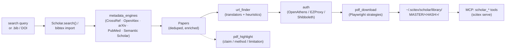

# SciTeX Scholar (`scitex-scholar`)

<p align="center">
  <a href="https://scitex.ai">
    
  </a>
</p>

<p align="center"><b>Scientific paper search, enrichment, PDF download, and library management for reproducible research.</b></p>

<p align="center">
  <a href="https://scitex-scholar.readthedocs.io/">Full Documentation</a> · <code>uv pip install scitex-scholar[all]</code>
</p>

<!-- scitex-badges:start -->
<p align="center">
  <a href="https://pypi.org/project/scitex-scholar/"></a>
  <a href="https://pypi.org/project/scitex-scholar/"></a>
  <a href="https://github.com/ywatanabe1989/scitex-scholar/actions/workflows/rtd-sphinx-build-on-ubuntu-latest.yml"></a>
</p>
<p align="center">
  <a href="https://github.com/ywatanabe1989/scitex-scholar/actions/workflows/pytest-matrix-on-ubuntu-py3-11-3-12-3-13.yml"></a>
  <a href="https://codecov.io/gh/ywatanabe1989/scitex-scholar"></a>
  <a href="https://www.gnu.org/licenses/agpl-3.0"></a>
</p>
<!-- scitex-badges:end -->

---

## Problem and Solution


| # | Problem | Solution |
|---|---------|----------|
| 1 | **Literature search is balkanized** -- CrossRef / OpenAlex / Semantic Scholar / arXiv / PubMed each have different APIs, rate limits, auth | **Unified search** -- `scitex scholar search "topic"` federates across all, deduplicates by DOI, returns ranked results |
| 2 | **BibTeX from the wild is missing abstracts / DOIs / impact factors** -- manuscript prep wastes hours | **`scitex scholar bibtex` enrichment** -- one call resolves DOIs, fetches abstracts, adds impact factors, normalizes formatting |
| 3 | **Paywalled PDFs require institutional login per journal** -- manual login-download-rename is the bottleneck | **Browser-automation + OAuth** -- persistent Chrome profile with stealth; `scitex scholar fetch 10.1038/...` grabs the PDF end-to-end |

## Problem

Literature management spans many tools and APIs: searching databases, resolving DOIs, downloading PDFs through institutional access, enriching BibTeX metadata, and keeping a reproducible, deduplicated library. Each step speaks a different library, auth flow, and data format.

## Solution

`scitex-scholar` provides a unified workflow:

- **Search** across CrossRef, Semantic Scholar, PubMed, arXiv, and OpenAlex
- **Resolve** DOIs from titles; enrich BibTeX with abstracts, citation counts, impact factors (JCR 2024), PMIDs, and arXiv IDs
- **Download** PDFs through institutional access (OpenAthens / SSO) with Playwright browser automation
- **Organize** papers in a MASTER-hash library with per-project symlinks at `~/.scitex/scholar/library/`. One-button maintenance via `library refresh` (reconcile → regenerate readable names → optional rsync to remote hosts)
- **Highlight** each sentence of a PDF by rhetorical role — claim, method, limitation, supportive citation, contradicting citation — via Claude
- **Automate** the same operations from the CLI, a Python API, or the SciTeX MCP server

## Installation

```bash
pip install scitex-scholar                 # core
pip install "scitex-scholar[pdf]"          # PDF text extraction
pip install "scitex-scholar[mcp]"          # MCP server deps (fastmcp)
pip install "scitex-scholar[browser]"      # Playwright automation
pip install "scitex-scholar[all]"          # everything
```

## 4 Interfaces

<details open>
<summary><strong>Python API</strong></summary>

<br>

```python
from scitex_scholar import Scholar, Paper, Papers, apply_filters, to_bibtex

scholar = Scholar()
papers = scholar.search("deep learning EEG", year_min=2020)   # auto-enriched
papers.save("results.bib")

# Filter + export
top = apply_filters(papers, min_citations=50, min_impact_factor=5.0)
print(to_bibtex(top))
```

</details>

<details>
<summary><strong>CLI</strong></summary>

<br>

Entry point: `scitex-scholar <subcommand>` (Click-based).

```bash
# Discover everything
scitex-scholar --help
scitex-scholar --help-recursive          # full overview, every leaf
scitex-scholar --version                  # or -V

# Paper(s)
scitex-scholar paper fetch --doi 10.1038/nature12373 --project demo
scitex-scholar paper fetch-batch --dois 10.1038/xxx --dois 10.1126/yyy --project demo --num-workers 4

# BibTeX file
scitex-scholar bibtex import --bibtex refs.bib --project demo --output refs.enriched.bib

# PDF post-processing
scitex-scholar pdf highlight paper.pdf

# Library — daily workflow
scitex-scholar library list                                   # all projects
scitex-scholar library list neurovista                        # one project, per-paper
scitex-scholar library open-urls neurovista --watch           # browser + auto-import
scitex-scholar library refresh neurovista                     # one-button maintenance
scitex-scholar library refresh neurovista --sync spartan      # +rsync push (repeatable)

# Library — manual PDF import (when DBs haven't indexed yet, or no auto-download)
scitex-scholar paper fetch --doi 10.1002/epi.70076 \
    --pdf-main ~/Downloads/Liu_2026.pdf \
    --pdf-supple ~/Downloads/MOESM1_ESM.pdf \
    --attachment ~/Downloads/dataset.csv \
    --project neurovista

# Library — layout / share / integrity
scitex-scholar library bind neurovista ~/proj/neurovista      # one symlink, no data move
scitex-scholar library export neurovista --format bibtex
scitex-scholar library audit-files --project neurovista
scitex-scholar library db build --dry-run
scitex-scholar library db audit --json

# Auth (institutional SSO — OpenAthens / EZProxy / Shibboleth)
scitex-scholar auth status              # exit 0 if any session valid, 1 otherwise
scitex-scholar auth login               # trigger SSO flow now (debug-friendly)
scitex-scholar auth logout -y           # clear cached cookies (--yes required)
scitex-scholar auth refresh             # logout + login

# MCP server
scitex-scholar mcp start
scitex-scholar mcp list-tools --json

# Shell completion
scitex-scholar install-shell-completion --shell bash
scitex-scholar print-shell-completion --shell bash

# Skills + Python API introspection
scitex-scholar skills list
scitex-scholar list-python-apis -v
```

### Debugging the SSO automator

Every browser-automation step writes a screenshot + HTML pair to
`~/.scitex/scholar/cache/engine/screenshots/` and
`~/.scitex/browser/cache/debug/`. When a selector breaks (e.g. an
Okta UI refresh), `ls -lt` the artifact dirs to get a frame-by-frame
storyboard — the screenshot shows what was rendered, the HTML
shows what the locator was reasoning over. See
`_skills/scitex-browser/11_debugging-visuals.md` for the full pattern.

Mutating verbs accept `--dry-run` and `-y/--yes`. Read verbs support `--json`.
Common paper/bibtex flags: `--browser-mode {stealth,interactive}`, `--chrome-profile NAME`, `--force`.

> **Migration (1.3.0):** the CLI moved to noun-verb groups. Old top-level commands
> (`single`, `parallel`, top-level `bibtex --bibtex`, `highlight`, `link-project-tree`,
> `materialize`, `dematerialize`, `db`) still work but emit a `DeprecationWarning`
> and will be removed in 1.4.0. See [CHANGELOG.md](CHANGELOG.md) for the full
> migration table.

</details>

<details>
<summary><strong>MCP Server</strong></summary>

<br>

The package ships MCP tool handlers consumed by the unified `scitex serve`
server (tools prefixed `scholar_*`). A standalone server at
`scitex_scholar.mcp_server` is still shipped but deprecated. See the
[Skills documentation](https://scitex-scholar.readthedocs.io/en/latest/skills.html)
for the full tool list.

</details>

<details>
<summary><strong>Skills</strong></summary>

<br>

Agent skill pages are published at
[scitex-scholar.readthedocs.io/en/latest/skills.html](https://scitex-scholar.readthedocs.io/en/latest/skills.html).
The `semantic-highlight` skill documents the PDF-highlighting workflow.

</details>

## Core API

| Symbol | Purpose |
|-----------------|---------|
| `Scholar` | Main search / enrich / download / save interface |
| `Paper`, `Papers` | Single paper / collection with export methods |
| `ScholarConfig` | Paths, API keys, auto-enrich toggle, browser settings |
| `apply_filters` | Filter a `Papers` collection |
| `to_bibtex`, `to_ris`, `to_endnote`, `to_text_citation` | Export formats |
| `generate_cite_key`, `make_citation_key` | Deterministic BibTeX keys |
| `CitationGraphBuilder`, `plot_citation_graph` | Optional citation graph |
| `pdf_highlight.highlight_pdf` | Overlay semantic highlights on a PDF |

Sources: `core/`, `search_engines/`, `metadata_engines/`, `pdf_download/`, `pipelines/`, `browser/`, `auth/`, `storage/`, `pdf_highlight/`, `_mcp/`.

## Semantic PDF Highlighting

Overlay colour-coded highlights on a PDF that separate what the paper **claims** from its
**methods**, **self-admitted limitations**, and stance toward related work. Highlights are
standard PDF annotation objects placed on a copy of the source — the original bytes are unchanged
and any viewer can show or strip them.

| colour | category | meaning |
|---|---|---|
| green | `focal_claim` | what the paper clarifies, suggests, demonstrates |
| purple | `focal_method` | novel method, model, cohort, or analysis |
| red | `focal_limitation` | self-admitted caveat or threat to validity |
| blue | `related_supportive` | prior work whose finding supports the paper |
| orange | `related_contradictive` | prior work whose finding contradicts the paper |

A compact colour legend + signature (model name, timestamp) is stamped in the lower-right corner
of the last page. See [docs](https://scitex-scholar.readthedocs.io/en/latest/semantic_highlight.html)
for full details.

```bash
export ANTHROPIC_API_KEY=sk-ant-...
scitex-scholar pdf highlight paper.pdf        # sentence-level, Haiku, writes paper.highlighted.pdf
scitex-scholar pdf highlight paper.pdf --stub # offline keyword heuristic (no API calls)
```

```python
from scitex_scholar.pdf_highlight import highlight_pdf
result = highlight_pdf("paper.pdf", output_path="paper.highlighted.pdf")
print(result.counts(), result.annotations_added)
```

Also exposed as the `scholar_highlight_pdf` MCP tool (unified `scitex serve` server) and as the
`semantic-highlight` agent skill (see
[skills documentation](https://scitex-scholar.readthedocs.io/en/latest/skills.html)).

## Storage layout

```
~/.scitex/scholar/library/
├── MASTER/<HASH>/               # Canonical per-paper storage (metadata.json + PDF)
└── <project>/<human-label> -> ../MASTER/<HASH>
```

Cache and auth state live under `~/.scitex/scholar/cache/` (URL resolver, Chrome profiles, OpenAthens cookies). Override with `SCITEX_DIR`.

## Architecture

```
scitex_scholar/
├── __init__.py            ← public API (Scholar, Paper, Papers, apply_filters, to_bibtex)
├── _cli_main.py           ← `scitex-scholar` Click entry point (noun-verb groups)
├── core/                  ← Scholar / Paper / Papers / ScholarConfig
├── search_engines/        ← CrossRef, OpenAlex, Semantic Scholar, arXiv, PubMed federation
├── metadata_engines/      ← DOI resolution, abstract / IF / citation enrichment
├── auth/                  ← OpenAthens / EZProxy / Shibboleth / SSO automators
├── browser/               ← persistent-profile Playwright manager (stealth + interactive)
├── url_finder/            ← PDF URL discovery (translators + heuristic strategies)
├── pdf_download/          ← `paper fetch` strategies (chrome viewer, direct, fallback)
├── pdf_highlight/         ← claim/method/limitation overlay via Claude
├── pipelines/             ← end-to-end @session-decorated workflows
├── storage/               ← MASTER-hash library + per-project symlinks
├── citation_graph/        ← optional citation network builder + plot
├── integration/           ← Zotero / Mendeley / RefWorks / EndNote / Paperpile importers
├── _mcp/                  ← MCP tool handlers (`scholar_*` tools for `scitex serve`)
└── _skills/               ← agent-facing skill files (semantic-highlight, etc.)
```

The CLI is a thin layer over the Python API: every `scitex-scholar <noun> <verb>` command dispatches into one of `core/`, `pipelines/`, `storage/`, or `auth/`. The MCP server (`_mcp/`) exposes the same handlers as `scholar_*` tools consumed by the unified `scitex serve` server.

## Demo



`scitex-scholar paper fetch --doi 10.1038/...` exercises the full chain in one call: enrich → resolve URL → authenticate → download → store under `MASTER/<HASH>/` with metadata + PDF + per-project symlinks.

## License

AGPL-3.0-only.

## Part of SciTeX

`scitex-scholar` is part of [**SciTeX**](https://scitex.ai). Install via
the umbrella with `pip install scitex[scholar]` to use as
`scitex.scholar` (Python) or `scitex scholar ...` (CLI).

> Four Freedoms for Research
>
> 0. The freedom to **run** your research anywhere — your machine, your terms.
> 1. The freedom to **study** how every step works — from raw data to final manuscript.
> 2. The freedom to **redistribute** your workflows, not just your papers.
> 3. The freedom to **modify** any module and share improvements with the community.
>
> AGPL-3.0 — because we believe research infrastructure deserves the same freedoms as the software it runs on.

---

<p align="center">
  <a href="https://scitex.ai" target="_blank"></a>
</p>
